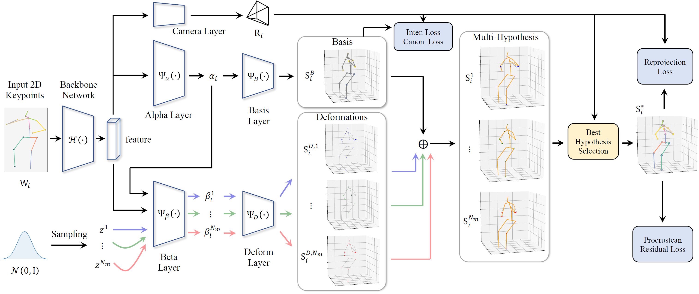

# MHR-Net
Official PyTorch implementation of ECCV 2022 paper **MHR-Net: Multiple-Hypothesis Reconstruction of Non-Rigid Shapes from 2D Views**. [Paper Link.](https://arxiv.org/abs/2207.09086)

<p align="center"></p>


## Requirements
* Python 3.7
* PyTorch 1.7.1
* torch-batch-svd

Please follow [torch-batch-svd](https://github.com/KinglittleQ/torch-batch-svd) to install the library. We also provide a copy of this library which we used in the experiments in ./torch_batch_svd.

**************************************************************

# Data preparation
We use the data processing from [VideoPose3D](https://github.com/facebookresearch/VideoPose3D). The output .npz files should be placed in a data directory like:
```
${PROJECT_ROOT}/
|-- data
|   |-- data_3d_h36m.npz
|   |-- data_2d_h36m_gt.npz
```
The dataset can also be downloaded from [here](https://drive.google.com/file/d/1EwSIBohZrzbJn-kJqwNvn93JJlHLcesv/view).

***************************************************************

## Training

```
python train.py -k gt -e [num_epochs] -c [exp_dir] -hp [hparams]
```

We provide the script with the hyper parameters we used in this paper. To achieve a better result, we pre-train the model without procrustean loss for 9 epochs and start full training from the checkpoint. The checkpoint can be downloaded from [here](https://drive.google.com/file/d/1A0mbDJ0bdy0CE1UOkpW20BlmKkfVQ00m/view) and should be put into the checkpoint direction:
```
${PROJECT_ROOT}/
|-- checkpoint
|   |-- run1
|       |-- model_epoch_9.bin
```

After that, run the script to start training:
```
bash ./train_script.sh
```

*******************************************************************

# Citation
If you find our work useful in your research, please cite the paper:

```
@inproceedings{MHR_NET,
  author    = {Haitian Zeng and
               Xin Yu and
               Jiaxu Miao and
               Yi Yang},
  title     = {MHR-Net: Multiple-Hypothesis Reconstruction of Non-Rigid Shapes from 2D Views},
  booktitle = {European Conference on Computer Vision},
  year      = {2022}
}
```

*******************************************************************

# Acknowledgement
Our code is based on the following repositories. We thank the authors for releasing their codes.

- [ITES](https://github.com/sjtuxcx/ITES)
- [C3DPO](https://github.com/facebookresearch/c3dpo_nrsfm)
- [VideoPose3D](https://github.com/facebookresearch/VideoPose3D)
